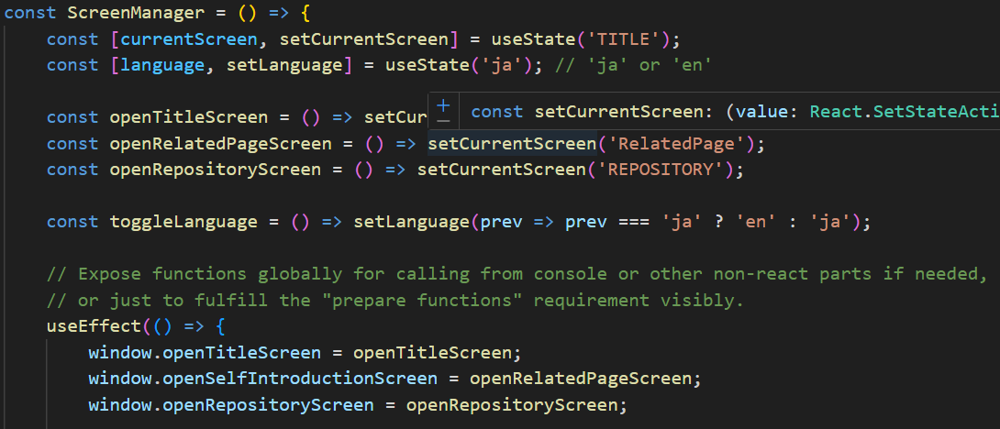
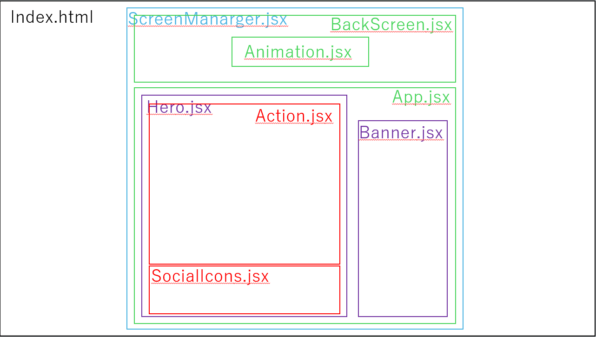

# サイトのリンク
https://tealands.github.io/ShigersPage/

# 今後の開発予定
- 書いたnote記事のリンク
- オリジナル問題集ページ
- 趣味で書いた企画書一覧
- 予備自衛官補について自己紹介文

# 使用技術
- HTML(index.htmlだけ)
- React(Componentsで大量に使った)
- CSS(htmlの整形とアニメーションコンポーネントで使った)

割とアロー関数を多用している

ここら辺の画像はGeminiに出力させた

# 大まかな構造
### ホーム画面
index.html->main.jsx->ScreenManager.jsx(画面遷移を管理)
 &emsp;->HeaderPicture.jsx
 &emsp;->Animetion.jsx
 &emsp;->App.jsx->Hero.jsx
 &emsp;&emsp;->Action.jsx
 &emsp;&emsp;->SocialIcons.jsx
 &emsp;->Banner.jsx

### リポジトリ画面
index.html->main.jsx->ScreenManager.jsx(画面遷移を管理)
 &emsp;->RepositryScreen.jsx->Repositries.jsx

### 関連サイト画面
index.html->main.jsx->ScreenManager.jsx(画面遷移を管理)
 &emsp;->RelatedPageScreen.jsx

